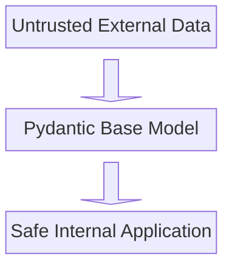

# Introduction to Pydantic

## Guiding Questions: 

1. Why does Pydantic exist?
2. What is a `BaseModel`?
3. Automatic validation
4. Creating the first model
5. How FastAPI uses `BaseModel`

---

> 	*"Happy path testing verifies that a system functions correctly when users follow the intended workflow with valid inputs and expected behaviors"*.[1](https://www.virtuosoqa.com/post/happy-path-testing)
## Why Pydantic?
Perfect workflows only exist in theory. When it comes to real-world systems and applications, even a flawless logic is not a guarantee of success. 

If you build web applications, or data pipelines in Python, you will eventually find yourself dealing with messy data coming from the outside world —A JSON payload from an API, a form submitted by a user or a raw record from a database. 

Imagine you're building an e-commerce backend, and you expect a product payload to look like this: 

```python
incoming_data = {
	"product_id": 456,
	"name": "Wireless Mouse",
	"price": 29.99,
	"tags": ["electronics", "tech"]
}

```

Naturally, the first question developers ask when handling this is: *"How do ensure this data is actually what I expect before my application tries to use it?"*

### The First Solution Most People Write
Because you cannot trust external data, your first instinct might be to write a series of manual validation checks (defensive programming) to ensure data is safe to process:

```python
def process_product(data):
	if "product_id" not in data or not isinstance(data["product_id"], int):
		raise ValueError("Invalid Product ID")
	if "price" in data and data["price"] < 0:
		raise ValueError("Price cannot be negative")
		
	# ... more boilerplate checks ...
```

This is tedious, prone to human error, and does not escale. Furthermore, Python is dynamically typed. [Type annotations](https://peps.python.org/pep-0484/) (like `def process(product_id: int)`) are great for checking logic errors during development, through the use of tools like Pyright or Ruff, but the Python interpreter ignores them completely at runtime. If an API accidentally sends `"product_id": "456"` (a string), standard Pythin will happily accept it until it crashes a math operation later down the line. 

What if you could define the exact shape of your data once, and have Python enforce those rules automatically? 

### Meeting Pydantic and `BaseModel`
Pydantic is a widely used Python library for data validation and settings management. It exists to solve the problem of data reliability and runtime type safety. It enforces data types and constraints at runtime to ensure that the structure of the incoming data is safe to be ingested and processed by your application. What's special about Pydantic is that it does not extend the Python's existing syntax, but rather, leverages the built-in type hints as reference to enable runtime validation, clean type conversion, serialization/deserialization, and settings management. In a Nutshell, Pydantic transforms Python's optional type hints in your code into a strict, enforceable set of validation rules. 

`BaseModel` is the fundamental building block of Pydantic. It's a base class that packages the behavior and properties required for models to interact with Pydantic in real time during the application flow. 

### What `BaseModel` does for you:
- **Automatic Constructor**: You do not need to write an `__int__` method. It accepts keyword arguments automatically.
- **Input Parsing**: It takes raw, unstructured data (like a dictionary or JSON) and safely converts it into structured Python objects. 
- **Data Guarantee**: Once an object is succesfully created from a `BaseModel`, you are guaranteed that all attributes match their declared types.
- **Error Catching**: If the input data is invalid, it gathers all formatting errors at once instead of failing on the first one.

To use it, you create a class that inherits from Pydantic's `BaseModel`. Think of `BaseModel` as a blueprint for a contract.

```python
from typing import list
from pydantic import BaseModel, Field, EmailStr

class Product(BaseModel):
	product_id: int
	name: str
	price: float = Field(gt = 0, description="Price must be strictly greater than zero")
	tags: List[str] = []
	supplier_email: EmailStr | None = None
```

### How do I declare fields and common types?
In a `BaseModel`, you declare fields using standard Python type hints. 
- **Required fields**: Simply state the type (e.g., `name: str`). If this is missing from the incoming data, Pydantic will throw an error.
- **Optional fields**: Provide a default value (e.g., `tags = List[str] = []`).
- **Advanced validation**: Use [`Field()`](https://pydantic.dev/docs/validation/latest/concepts/fields/) to enforce strict rules beyond just the data type, such as `gt=0` (greater than zero) for numbers, or `min_length=3` for strings. 
- **Specialized types**: Pydantic provides custom types like `EmailStr` (which validates that a string is a properly formatted email address) or `HttpUrl`.

### The Mental Picture: The Border Guard
To truly understand Pydantic, stop thinking of `BaseModel` as a standard Python data container. Instead, view it as a strict **Border Security Guard** standing at the edge of your application. 



The outside world is chaotic. Data is messy. But once data passes through your Pydantic model and is instantiated, it is 100% guaranteed to match your types. You can write your core application logic without ever writing `if type(price) == float:` again.

### 5 Questions to Ask Before Writing a Model

To build effective Pydantic models, do not just start typing `class MyModel(BaseModel):`. Treat your data model like a formal API contract. Run through these five design questions to structure your schema correctly before writing a single line of code:

**1. What is the exact shape of the raw data?** Your model fields must perfectly mirror the incoming data payload. If you are consuming a JSON API that returns camelCase (`productId`), but your Python backend uses snake_case (`product_id`), you must configure Pydantic's `alias` generator to map them. It will not guess for you.

**2. Which fields will crash my app if they are missing?** Missing required fields will instantly halt your data ingestion.

- **Required:** Declare the type without a default value (`name: str`).
    
- **Optional:** Mark it with the pipe operator and explicitly provide a default (`supplier_email: EmailStr | None = None`).
    

**3. Are there constraints beyond basic data types?** An integer is not just an integer if it represents an age (cannot be negative). A string is not just a string if it represents a username (must be between 3 and 15 characters). Identify where you need to use `Field()` to enforce structural reality, like `gt=0` or `max_length=15`.

**4. Should Pydantic fix bad data, or reject it completely?** By default, Pydantic uses "lax mode," meaning it will actively coerce the string `"123"` into the integer `123`. If you are dealing with highly sensitive or financial data, automatic conversion might be a liability. You must decide whether to enforce `strict=True` to reject anything that doesn't perfectly match your requested type.

**5. Does this data contain nested structures?** Flat models are rare in real-world applications. Data usually contains sub-objects or arrays. Break down complex structures into smaller, independent child models first. If a product has a list of reviews, you write the `Review` model first, and then declare `reviews: list[Review]` inside your `Product` model.

Should we build out a concrete code example of that fifth point—handling nested data structures—to include as the next logical step in the guide?

## How Automatic Validation (And Coercion) Works
When you pass data into your model (`Product(incoming_data)`), Pydantic does not just passively validate; it actively **coerces** (cleans) the data if it is safe to do so. 

Watch what happens when we pass slightly mismatched data:

```python
raw_payload = {
    "product_id": "456",       # A string, not an int
    "name": "Wireless Mouse",
    "price": "29.99",          # A string, not a float
    "tags": ["electronics"]
}

product = Product(**raw_payload)

print(type(product.product_id)) # <class 'int'>
print(type(product.price))      # <class 'float'>
```

Pydantic saw the strings, realized they contained valid numbers, and automatically converted them to `int` and `float` respectively
### What if the data can't be coerced?
If the data is fundamentally broken, and cannot be coerced (the incoming type is not compatible with the receiving model field), Pydantic instantly halts execution and raises a `ValidationError`. 

```python
bad_payload = {
    "product_id": "abc",  # Cannot be converted to int
    "name": "Broken Keyboard",
    "price": -10.00,      # Violates the Field(gt=0) constraint
}

Product(**bad_payload)
```

Instead of a cryptic traceback, Pydantic outputs exactly what went wrong, pointing to the specific fields:

```shell
pydantic_core._pydantic_core.ValidationError: 2 validation errors for Product
product_id
  Input should be a valid integer, unable to parse string as an integer [type=int_parsing, ...]
price
  Input should be greater than 0 [type=greater_than, ...]
```

### How does FastAPI use Pydantic?
If you are using FastAPI, Pydantic is the engine powering its request routing.

When you define an endpoint in FastAPI, you set a Pydantic `BaseModel` as the expected request body. FastAPI takes over from there:

1. It intercepts the incoming HTTP request.
2. It hands the JSON payload to your Pydantic model.
3. If validation fails, FastAPI automatically intercepts the `ValidationError` and returns a clean HTTP `422 Unprocessable Entity` response to the client, detailing exactly which fields were wrong.
4. If it succeeds, FastAPI hands your route a fully parsed, safe Python object.
5. It uses the `BaseModel` to automatically generate your API's Swagger/OpenAPI documentation.

## One Principle to Remember

When designing applications, push validation to the absolute edges of your system.

Whenever you are pulling data from a database, accepting a web request, or reading a JSON file, pause and ask: 

> ***"Am I about to write manual type checks or assume this data is perfect?"***

If the answer is yes, put a Pydantic `BaseModel` at that boundary.