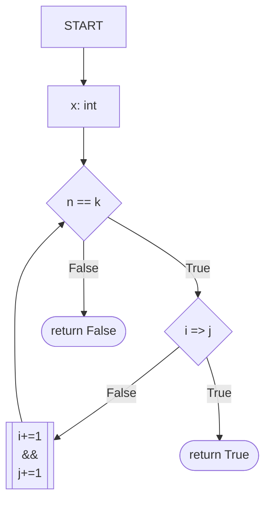
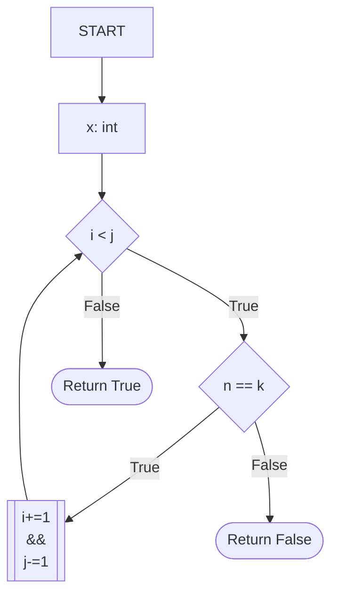
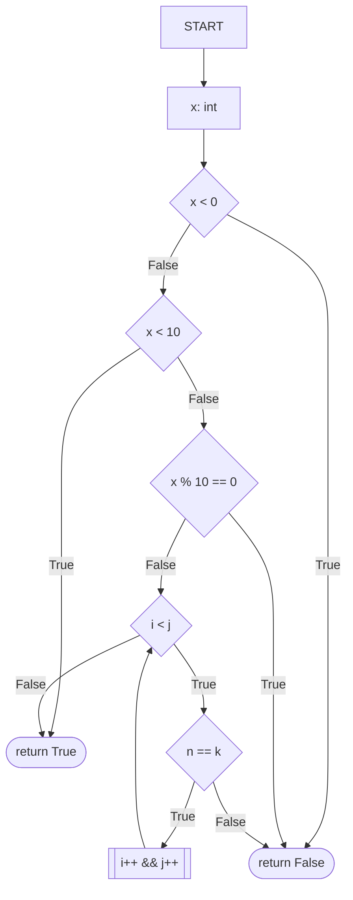
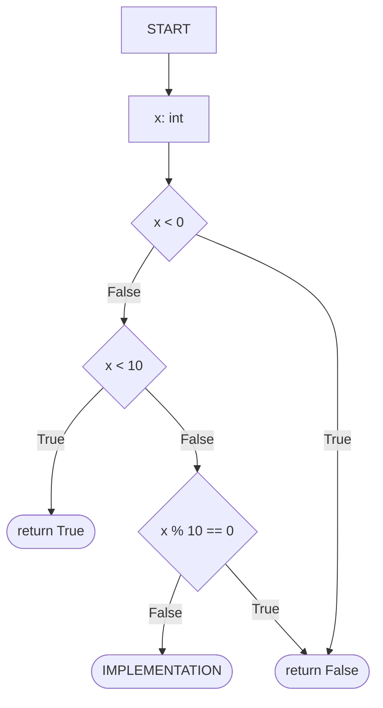
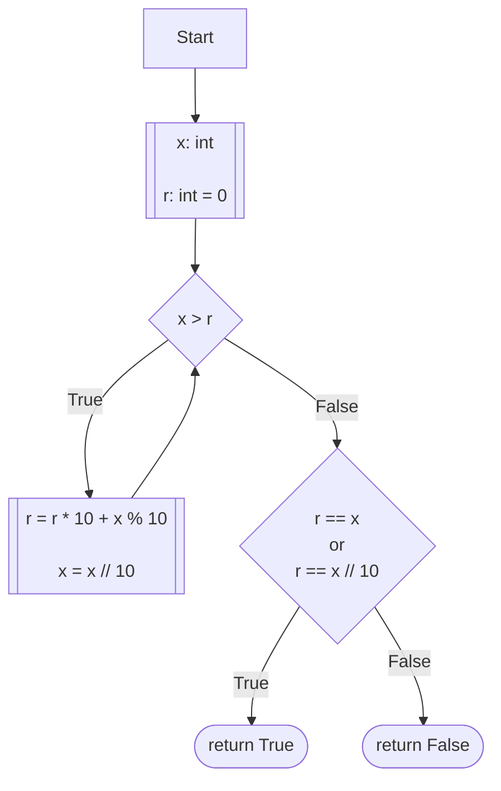

# [9. Palindrome Number](https://leetcode.com/problems/palindrome-number/)

**Status**: Solved
**Difficulty**: Easy

Given an integer `x`, return `true` _if_ `x` _is a_ _, and_ `false` _otherwise_.

**Example 1:**
* ***Input:** x = 121
* ***Output:** true
* ***Explanation:** 121 reads as 121 from left to right and from right to left.

**Example 2:**
* ***Input:** x = -121
* ***Output:** false
* ***Explanation:** From left to right, it reads -121. From right to left, it becomes 121-. Therefore it is not a palindrome.

**Example 3:**
* ***Input:** x = 10
* ***Output:** false
* ***Explanation:** Reads 01 from right to left. Therefore it is not a palindrome.

**Constraints:**
- $-2^{31} <= x <= 2^{31} - 1$

**Follow up:** Could you solve it without converting the integer to a string?

---
## Intuition
The first approach that came to mind was the two-pointer technique: By placing one pointer at the start of the sequence and another at the end, we can compare corresponding digits moving inward. The sequence is a palindrome if every pair of pointers is the exact match of each other.
## Two-pointers Approach

We initialize two pointers: `i` at the first index (0) and `j` at the last index (`length - 1`). In each iteration, we compare the digits at these positions:

- **Mismatch:** If the digits at `i` and `j` are not equal, the sequence is not a palindrome, and we immediately return `False`.
    
- **Continuation:** If they match, we increment `i` and decrement `j`, continuing the process.
    
We repeat this until the pointers meet or cross, specifically when `i >= j`. If the loop completes without finding any mismatched pairs, all mirrored digits are equivalent, confirming the sequence is a palindrome.

Initially, I sketched a flow so that the value comparisons occurs before verifying whether the pointers have not passed the half of the sequence, resulting in redundant computations.



To prevent this, the logic was restructured so as to check the loop invariant (`i < j`) first. 

If the condition is met, we proceed to compare the digits; if not, we have exhausted the sequence and can confidently return `True`. This approach is cleaner and more efficient.

### Logic Flow

1. **Check Condition:** If `i < j`, continue; otherwise, return `True`.
    
2. **Compare:** Check if the digits at `w[i]` and `w[j]` are equal.
    
3. **Iterate or Exit:** If they match, move the pointers inward (`i++`, `j--`) and repeat. If they mismatch, return `False` immediately.
    




With this mental model, we were ready to jump to the implementation. The two-pointer strategy requires random access to the digits. Since integers are not indexable in Python, the simplest implementation converts the number to a string and compares symmetric characters.

The first attempt was something like: 

```python
class Solution: 
	def isPalindrome(self, x: int) -> bool:
		# 1. Cast the X number as a string
		w: str = str(x)
		
		#  2. Initial conditions: since lists in Python are
		#     0-based indexed, we set i as 0, and j as the 
		#     array's lenght minus 1 
		
		i : int = 0
		j : int = len(w) - 1
		
		
		#  3. Iterate over pairs of positions
		while i < j:
		#  4. Compare digits in place
			n = w[i]
			k = w[j]
			if n == k:
				i += 1
				j -= 1
			else: 
				return False
		return True
		
```

### Optimized Logic

We can include guard clauses to identify non-palindromes with minimal computation. By validating the number before initiating the string conversion and loop, we avoid unnecessary overhead:

- **Negative Numbers:** The negative sign (`-`) will never be mirrored at the end of the number.
    
- **Multiples of 10:** Any number ending in `0` (other than `0` itself) cannot be a palindrome because integers cannot start with `0`.
    
- **Single Digits:** Any single-digit number is inherently a palindrome.




## Refined Implementation

Separating the **validation logic** from the **core algorithm** is a best practice. It improves readability and makes our guard clause reusable across multiple implementations.


```python
class Solution:
    def isPalindrome(self, x: int) -> bool:
        # Guard clauses for common edge cases
        if x < 0:
            return False
        if x < 10:
            return True
        if x % 10 == 0:
            return False
        
        # Delegate to the algorithmic implementation
        return self._two_pointers(x)

    def _two_pointers(self, x: int) -> bool:
        s = str(x)
        i, j = 0, len(s) - 1
        while i < j:
            if s[i] != s[j]:
                return False
            i += 1
            j -= 1
        return True
```

## Time Complexity and Space complexity

To determine the time and space complexity of an algorithm, we analyze how the number of operation sor the amout of memory grows in proportion ot the input size ($n$). 

In this case, the input size ($n$) is the number of digits in the integer $x$

The number of digits in an integer $x$ is given by $n = \lfloor \log_{10}(x) \rfloor + 1$

1. **Time Complexity Analysis**

We evakyate the operations step-by-step:

* **Conversion to a String**: `s = str(x)` iterates through each digit of the number once to create a string representation. This takes $O(n)$ time.
* **Two-Pointer Loop**: The `while i < j` loop iterates from the outside of the string toward the middle. Since we compare two characters per iteration, we perform roughtly $n/2$ comparisons. In Big O notation, constants are dropped, so this is $O(n)$.
* **Total Time Complexity**: $O(n) + O(n) = O(2n)$, which simplifies to $O(n)$

**Note**: Because $n$ is the number of digits ($\log_{10}x$), the time complexity is technically $O(\log x)$.

2. **Space Complexity Analysis**: 

We evaluate how much extra memory the algorithm requires relative to the input: 

* **String Allocation**: The line `s = str(x)` creates a new string object in memory that stores all $n$ digits of the integer. 
* **Pointers**: The variables $i$ and $j$ only store integer indices, which take constant space, $O(1)$.
* **Total Space Complexity**: Since the space consumed is dominated by the string of lenght $n$, the total space complexity is $O(n)$ (or $O(\log x$)).

| Operation | Complexity | Reasoning                         |
| --------- | ---------- | --------------------------------- |
| Time      | $O(n)$     | We visit every digit exactly once |
| Space     | $O(n$)     | We store a string of length $n$   |

## Follow Up

I also wanted to explore two alternative accepted solutions from the LeetCode community. The following sections are not part of my original problem-solving process, but an exploratory analysis of approaches that taught me different ways to think about the same problem. 

The guard clause is used on each of the implementations, so from here, every diagram should be understood as: 



To analyze these algorithms, we maintain the definition that $n = \log_{10}(x) + 1$, representing the number of digits in $x$.
### Reverse a String
Instead of comparing symmetric characters using pointers, this approach creates an entirely reversed copy of the string representation of the number and performs a direct equality comparison.

```python
class Solution:
	def isPalindrome(self, x: int)-> bool:
		# Guard clauses
		return reverse_string(x)
			
    def reverse_string(self, x: int) -> bool:
        chars = str(x)
        rev_chars = "".join(
            chars[i]
            for i in range(len(chars) - 1, -1, -1)
        )
        
        return chars == rev_chars
```

I included the loop-based string reversal as it makes easier for me to reason about what the algorithm is doing, although, the extended slice syntax (`list[::-1]`) is considered the bests and most idiomatic way to reverse a string, or any list-like collection in Python. The reason is that it executes entirely at the C-level inside the Python interpreter, making it significantly faster and cleaner than any loop of functional alternative.

That being said, the best implementation of this approach would be something like:

```python
class Solution:
	def isPalindrome(self, x: int)-> bool:
		# Guard clauses
		return reverse_string(x)
			
    def reverse_string(self, x: int) -> bool:
        chars: = str(x)
        rev_chars: str = chars[::-1]
        return chars == rev_chars 
```

* **Time Complexity**: The conversion to a string, the slicing operation (creating a reversed copy), and the final equality comparison all iterate throguh the $n$ digits. This results in $O(n) + O(n) + O(n)$, which simplifies to $O(n)$.
* **Space Complexity**: The algorithm creates two new string (`chars` and `rev_chars`), each of length $n$. This requires $O(n)$ auxiliary space.
### Reverse the Integer (half of it)
This is the most sophisticated and efficient solution, allowing to evaluate a number as a palindrome without converting it to a string. The algorithm works by reversing the second half of the number and comparing it to the first half. 

The Python implementation is as follows:

```python
class Solution:
    def isPalindrome(self, x: int) -> bool:
        ## ... 
        return reverse_half(x)

    def reverse_half(self, x: int) -> bool:
        r: int = 0
        while x > r:
            r = r * 10 + x % 10
            x //= 10
        return x == r or x == r // 10

```


**Core logic**:
1. **Termination condition**: The `while x > r` loop continues only until the `r` integer ( the reversed second half) contains at least half of the digits. At this point, the process has reached the middle of the input number.

2. **Digit Extraction**: 
	* `x % 10` extracts the last digit of the current `x`
	* `r * 10 + x % 10` shifts the existing reversed digits left and appends the new digit to our `r` integer
	* `x // = 10` removes the last digit from the original number

3. **Comparison**: The comparison occurs only at the return level, once the loop has ended. 
	* `x == rev` handles cases with an even number of digits, while `x == r // 10` handles cases with an odd number of digits by removing the middle digit.
	* The `or` operator guarantees that the resulting boolean is `True` only if one of the cases is evaluated as `True`.

Conceptually, the algorithm flow should be something like:




To illustrate better what's happening at runtime, let's follow the $x$, and $r$ values through every iteration for the case $x = 12321$

| Iteration | Inputs `x` | `r` | `x > r` |
| --------- | ---------- | --- | ------- |
| 0         | 12321      | 0   | True    |
| 1         | 1232       | 1   | True    |
| 2         | 123        | 12  | True    |
| 3         | 12         | 123 | False   |

Once the loop terminates, `x = 12` and `r = 123`. 

Finally, since `x == r` is `False`, we fall back to `x == r // 10` that outputs `True`, confirming that our number is a Palindrome. 

* **Time Complexity**: The `while` loop runs exactly once every two digits in the input (halving the number in each iteration). Therefore, it runs $n/2$ times. As we drop constants, the time complexity is $O(n)$
	* ***Note**: While the asymptotic complexity is the same as the string method, the constant factor is smaller because it performs fewer operations and avoids allocation*. 
* **Space Complexity**: This algorithm uses a few integer variables (`r` and the modified `x`). Since it does not create a string or an array proportional to the input, it uses $O(1)$ (constant) auxiliary space.

## Takeaways

 A correct solution is not necessarily the only interesting solution. Studying alternative implementations often reveals different ways of reasoning about the same problem.  

**Complexity vs. Efficiency:** Both the two-pointer and the mathematical approach share $O(n)$ time complexity. However, the `reverse_half` approach is superior because it achieves $O(1)$ space complexity, whereas string conversion scales memory usage linearly with the number of digits.

| **Implementation** | **Time Complexity** | **Space Complexity** | **Notes**                                        |
| ------------------ | ------------------- | -------------------- | ------------------------------------------------ |
| `two_pointers`     | $O(n)$              | $O(n)$               | Intuitive, but uses extra memory.                |
| `reverse_string`   | $O(n)$              | $O(n)$               | Very concise code, but inefficient memory usage. |
| `reverse_half`     | $O(n)$              | $O(1)$               | **Optimal.** Uses no extra data structures.      |
**The Power of Invariants:** Using guard clauses (for negative numbers, multiples of 10, etc.) acts as a "fast path" that minimizes operations. Identifying these edge cases early is often the difference between a good solution and an optimized one.

**The "No-String" Constraint:** In interview settings, the constraint to avoid string conversion is a signal to utilize modular arithmetic (`% 10`) and integer division (`// 10`). Mastering these two operators allows you to decompose any number into its constituent digits without secondary data structures.

**Memory Overhead and Immutability**: In Python, strings are immutable. Every time we slice (`[::-1]`) or perform concatenation, we are creating new objects in memory. By working directly with integers, we bypass the overhead of Python's string object allocation entirely, which is a critical high-performance or low memory systems.

**Logical Refinement:** Visualizing logic with diagrams (like the Mermaid flowcharts) helps identify "redundant logic" early in the development process, ensuring that the code you write is the minimal path to the correct result.

