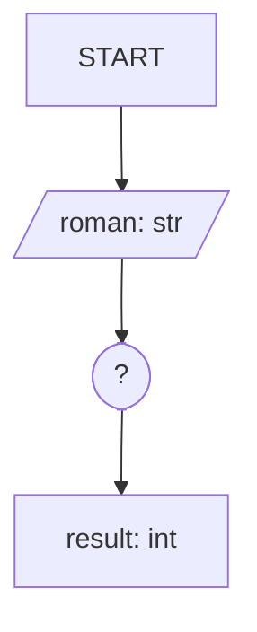
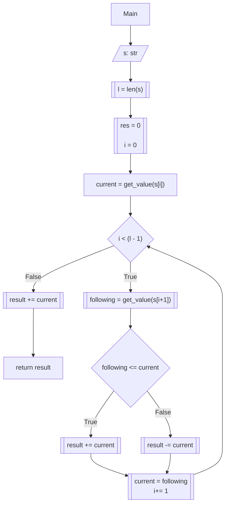

# [13. Roman to Integer](https://leetcode.com/problems/roman-to-integer/)

Status: Solved
Difficulty: Easy

---

## Problem Statement 
Roman numerals are represented by seven different symbols: `I`, `V`, `X`, `L`, `C`, `D` and `M`.

**Symbol**       **Value**
I             1
V             5
X             10
L             50
C             100
D             500
M             1000

For example, `2` is written as `II` in Roman numeral, just two ones added together. `12` is written as `XII`, which is simply `X + II`. The number `27` is written as `XXVII`, which is `XX + V + II`.

Roman numerals are usually written largest to smallest from left to right. However, the numeral for four is not `IIII`. Instead, the number four is written as `IV`. Because the one is before the five we subtract it making four. The same principle applies to the number nine, which is written as `IX`. There are six instances where subtraction is used:

- `I` can be placed before `V` (5) and `X` (10) to make 4 and 9. 
- `X` can be placed before `L` (50) and `C` (100) to make 40 and 90. 
- `C` can be placed before `D` (500) and `M` (1000) to make 400 and 900.

Given a roman numeral, convert it to an integer.

**Example 1:**

**Input:** s = "III"
**Output:** 3
**Explanation:** III = 3.

**Example 2:**

**Input:** s = "LVIII"
**Output:** 58
**Explanation:** L = 50, V= 5, III = 3.

**Example 3:**

**Input:** s = "MCMXCIV"
**Output:** 1994
**Explanation:** M = 1000, CM = 900, XC = 90 and IV = 4.

**Constraints:**

- `1 <= s.length <= 15`
- `s` contains only the characters `('I', 'V', 'X', 'L', 'C', 'D', 'M')`.
- It is **guaranteed** that `s` is a valid roman numeral in the range `[1, 3999]`.

---
## Intuition

The goal is to convert a valid Roman numeral into its integer representation.



### Observations

The input string is processed from left to right.

Each Roman symbol has a fixed numerical value, so the final result is simply the sum of every symbol's contribution. The only complication comes from the six subtraction rules:

- `IV`, `IX`
- `XL`, `XC`
- `CD`, `CM`

My first idea was to explicitly detect each of these six cases with dedicated conditional branches. Although correct, that approach introduces unnecessary special-case logic.

A simpler observation is that all six cases share the same property:

> ***A symbol contributes negatively only when it is immediately followed by a symbol with a greater value***.

For example:

- `VI` → `5 + 1`
- `IV` → `-1 + 5`

Instead of recognizing the six subtractive pairs explicitly, we only need to compare each symbol with its right neighbor.

This reduces six independent cases into a single local comparison.
## Algorithm
The algorithm consists of two independent tasks:

1. Convert each Roman symbol into its numerical value.
2. Determine whether that value contributes positively or negatively to the final result.

### Symbol Mapping

A dictionary provides a constant-time (`O(1)`) mapping between each Roman symbol and its numerical value.

```python
symbols = {
    "I": 1,
    "V": 5,
    "X": 10,
    "L": 50,
    "C": 100,
    "D": 500,
    "M": 1000,
}
```


### Main Algorithm:
We take a `roman` string as input, and initialize our variables: 

* `result` to accumulate our addition results. 
* `i` is our loop index 
* `L` is our string's length

The initial implementation introduced a `get_value()` helper responsible for translating Roman symbols into integers. This kept the conversion logic separate from the traversal algorithm.
 
Before entering the loop, the first symbol is converted into its numerical value and stored as `current` using `get_value()`.

We must iterate over every position in the string until the end, ensuring the comparisons stop right before reading the last value, otherwise we'll get the classic out-of-bound error. 

The loop iterates until `L - 1`, ensuring that every iteration can safely inspect the next symbol (`i + 1`) without exceeding the string bounds. Once the loop finishes, only the final symbol remains to be added to the accumulated result.



### First Implementation (while)

```python
class Solution:
    def get_value(self, char: str) -> int:
        symbols: dict = dict(zip(["I", "V", "X", "L", "C", "D", "M"], [1, 5, 10, 50, 100, 500, 1000]))
        if char in symbols:
            return symbols[char]
        return 0

    def romanToInt(self, s: str) -> int:
        L: int = len(s)
        res, i = 0, 0
        current: int = self.get_value(s[i])
        while i < L -1:
            following: int = self.get_value(s[i+1])
            if following <= current:
                res += current
            else: 
                res -= current
            current = following
            i += 1
        res += current
        return res 

```

A couple of observations regarding the initial implementation:
- My initial implementation wrapped the symbols dictionary in a `get_value()` helper. While this respected the Single Responsibility Principle, it ultimately added unnecessary indirection because Python dictionaries already provide the lookup operation directly.
- The get_value() method also introduced a guardrail of returning `0` in case the key was not found, but the exercise guaranteed a valid set of characters to be provided, so the guardrail was unnecessary complexity and introduced potential unexpected behavior.
- The nature of the implemented loop relying on ordered local checks seems to fit better with a for loop, as the condition to exit is traveling to the end of an iterable object (a range).


### Refactoring
After submitting the initial solution, I explored accepted community implementations. I did not find a better algorithm, but I found several opportunities to express the same algorithm more clearly.

The refactoring focuses on readability rather than performance:

- Replace the `while` loop with a `for` loop.
- Remove the unnecessary `get_value()` wrapper by promoting the symbol mapping to a class-level constant.
- Express the sign computation as a single arithmetic operation by using a ternary operator.

Although these changes do not alter the algorithmic complexity, they improve readability and reduce boilerplate.

```python
class Solution:
    SYMBOLS: dict = {"I": 1, "V": 5, "X": 10, "L": 50, "C": 100, "D": 500, "M": 1000}

    def romanToInt(self, s: str) -> int:
        result: int = 0
        values = self.SYMBOLS
        current: int = values[s[0]]

        for i in range(len(s) - 1):
            following: int = values[s[i + 1]]
            result += current * (-1 if following > current else 1)
            current = following

        return result + current

```

## Complexity

* **Time Complexity**: $O(N)$, where $N$ is the length of the string $s$. We iterate through the string exactly once. Dictionary lookups have constant average-case complexity (`O(1)`), so each iteration performs a fixed amount of work.
* **Space Complexity**: $O(1)$. The mapping dictionary is of constant size (seven symbols), and we use a fixed amount of extra space for integer variables (`result`, `current`, `following`, `i`), regardless of the input size. 
## Takeaways

- **Generalizing Special Cases:** The six subtraction rules can all be expressed by a single invariant: a symbol contributes negatively only when the following symbol has a greater value.

- **Algorithm vs. Expression:** Refactoring the implementation from a `while` loop to a `for` loop did not change the algorithm. It simply produced a clearer expression of the same logic.

- **Keep Data Close to Its Usage:** Promoting the symbol mapping to a class-level constant removes unnecessary helper functions and clearly separates static configuration from algorithmic behavior.

- **Boundary Management:** When an algorithm requires looking ahead (`i + 1`), limiting the iteration to `len(sequence) - 1` and handling the final element afterward avoids unnecessary boundary checks.

* **Optimize After Understanding:** I experimented with replacing the dictionary by an ASCII lookup table. Although the idea appeared promising, it introduced additional complexity without any demonstrated benefit. This reinforced an important engineering principle: optimize only after understanding the algorithm, and verify improvements through measurement rather than intuition.