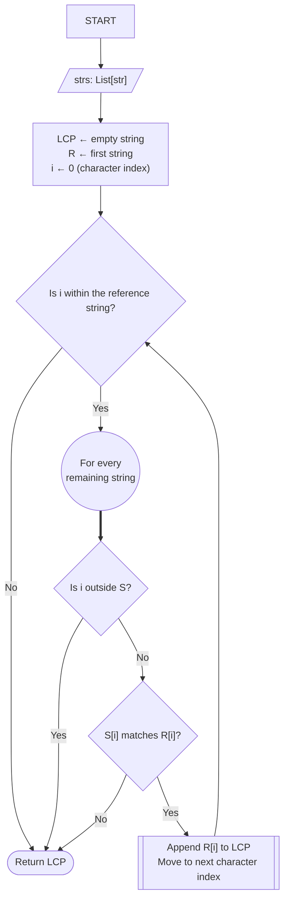
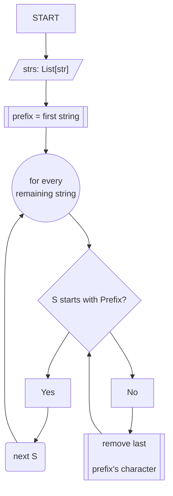
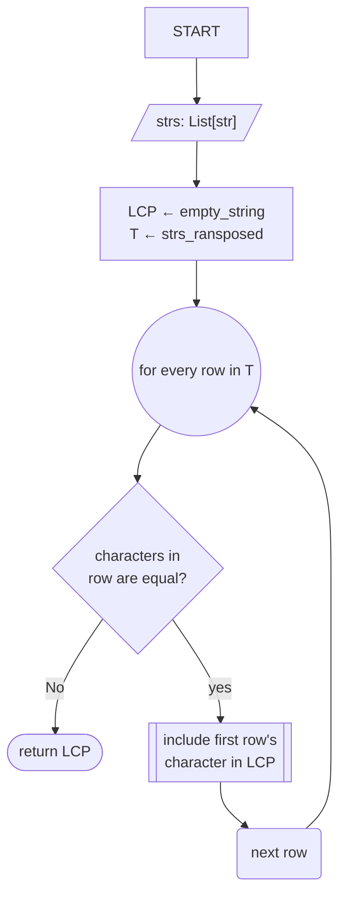
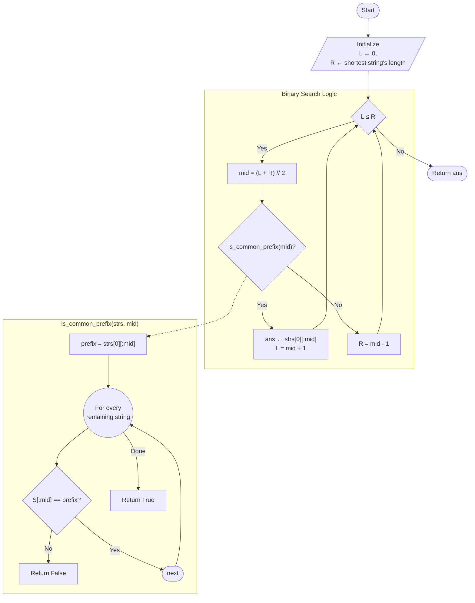

# [14. Longest Common Prefix](https://leetcode.com/problems/longest-common-prefix/)

Difficulty: Easy
Status: Pending

## Problem Statement

Write a function to find the longest common prefix string amongst an array of strings.

If there is no common prefix, return an empty string `""`.

**Example 1:**

**Input:** strs = ["flower", "flow", "flight"]
**Output:** "fl"

**Example 2:**

**Input:** strs = ["dog", "racecar", "car"]
**Output:** ""
**Explanation:** There is no common prefix among the input strings.

**Constraints:**

- `1 <= strs.length <= 200`
- `0 <= strs[i].length <= 200`
- `strs[i]` consists of only lowercase English letters if it is non-empty.

---

## Intuition
My initial approach is a two-pointer vertical scanning solution, the idea behind is: read every character in place, if its shared by every character, it's then part of the prefix. 
### Vertical Scanning: 

**Algorithm**: 

1) Select the first string as reference. 
2) Compare character from the reference string at a concrete position i, with every remaining string
	- if this character is shared by all strings, we include it as part of our prefix and jumpt to the next position. 
	- If at any position our pointer is out of bound, or we find a character mismatch, we exit returning the current state of the prefix.

The iterations continue until the first mismatch is found or all positions have been exhausted. 



**Implementation**:

```python
from typing import List


class Solution:
    def longestCommonPrefix(self, strs: List[str]) -> str:
        prefix = []
        ref_string = strs[0]
        i = 0

        while i < len(ref_string):
            s = 1
            while s < len(strs):
                eval_string = strs[s]
                if i >= len(eval_string):
                    return "".join(prefix)

                if eval_string[i] != ref_string[i]:
                    return "".join(prefix)
                s += 1
            prefix.append(ref_string[i])
            i += 1

        return "".join(prefix)

```

Notice that this implementation opted to store the characters in a list, rather than a string, since strings in Python are immutable, appending characters introduce a small overhead as the interpreter requires to sequentially create new strings and collect outdated string on garbage. While almost negligible for this scenario, it's considered a good practice.

**Refinements**: 

```Python
from typing import List


class Solution:
    def longestCommonPrefix(self, strs: List[str]) -> str:
        prefix = []
        ref_string = strs[0]
        for i, char in enumerate(ref_string):
            for string in strs[1:]:
                if i >= len(string) or string[i] != char:
                    return "".join(prefix)
            prefix.append(char)
        return "".join(prefix)

```
## Alternate solutions
"If I weren't allowed to compare columns, what else could I compare?"

The next approach is **horizontal scanning**: 
### Horizontal Scanning

**Algorithm**: If in the vertical scanning we were building a prefix character by character, this approach does the opposite. We assume an arbitrary string to be the longest common prefix, and sequentially compare it with following strings, shrink it the prefix as mismatches are found during every iteration.

Conceptually, the approach would be something close to: 


**Implementation**:
What makes this approach particularly easy to implement in Python, is the inclusion of the built-in `str.startswith()` method, which makes the main comparison lookup a trivial implementation task. 

```python
from typing import List

class Solution: 
	def longestCommonPrefix(self, strs: List[str]) -> str:
		return self.hscan(strs)
	
	def hscan(self, strs: List[str]) -> str:
		prefix = strs[0] # set first string as the LCP
		
		for string in strs[1:]:
			while not string.startswith(prefix):
				prefix = prefix[:-1]
		
		return prefix
```

### Matrix Transposition
This approach reformulates the problem by transposing the character matrix. Once transposed, every tuple corresponds to a character position across all strings, allowing us to verify one column at a time.

**Algorithm**: 


**Implementation**: 

I have a [guide](../../knowledge/python/zip) on `zip()`'s behavior and use cases, but, in a nutshell, this function combines multiple lists or iterables (like tuples or strings) element-by-element, pairing items at the same index together into tuples. 

Consider the following list of strings:

```python
strs = [
	'flower',
	'flow',
	'flight'
	]
```

We can transpose the matrix by using the unpacking feature, along with the unpacking operator: 

```python
transposed = list(zip(*strs))
```

The result is a list of tuples holding the characters of each column from the first arrangement. For our example, the transposed matrix would be: 

```python
transposed = [
	('f', 'f', 'f'), 
	('l', 'l', 'l'), 
	('o', 'o', 'i'), 
	('w', 'w', 'g')
	]
```

From here, the next step is to keep only the characters which are consistent across every tuple. 

The most common and pythonic approach to check if all elements in a tuple are equal is to convert the tuple into a set. Since a set only stores unique values, it will collapse all identical elements into a single.

```python
all_equal = len(set(transposed[i])) <= 1
```

The final solution would look like this: 

```python
class Solution:
    def longestCommonPrefix(self, strs: List[str]) -> str:
        prefix = []
        transposed = list(zip(*strs))

        for i, row in enumerate(transposed):
            if not len(set(row)) <= 1:
                return "".join(prefix)
            prefix.append(transposed[i][0])
        return "".join(prefix)        
```

### Binary Search
This is a classic Divide and Conquer approach. Rather than searching over the strings themselves, we search over the **possible prefix lengths**. The search space ranges from `0` to the length of the shortest string. For a candidate length `k`, we ask whether the first `k` characters are shared by every string.

**Algorithm**:

There are two key questions the algorithm should ask:
- Is a string of lenght $k$ a valid prefix?
- If there are more candidate prefixes, are those to the right or to the left? 

These two questions are to be responded separately. Binary search itself does not compare strings. Instead, it delegates that responsibility to a helper predicate `is_common_prefix(k)`, whose only job is to answer whether a prefix of length `k` is valid.



**Implementation**: 

```python
from typing import List

class Solution: 
    def longestCommonPrefix(self, strs: List[str]) -> str:
        def is_common_prefix(strs, k):
            prefix = strs[0][:k]
            for string in strs[1:]:
                if string[:k] != prefix:
                    return False
            return True
        
        left = 0
        right = min(len(string) for string in strs)
        answer = ""

        while left <= right:
            mid = (left + right) // 2
            if is_common_prefix(strs, mid):
                answer = strs[0][:mid]
                left = mid + 1
            else: 
                right = mid - 1
        return answer
```

## Complexity Summary

| Approach      | Time         | Space  |
| ------------- | ------------ | ------ |
| Vertical      | O(n·m)       | O(1)*  |
| Horizontal    | O(n·m)       | O(1)*  |
| zip           | O(n·m)       | O(n·m) |
| Binary Search | O(n·m·log m) | O(1)*  |
where

- `n = number of strings`
- `m = length of the shortest string`

Those symbols are more conventional, especially for interview-style explanations.

Using `S` isn't wrong if you define it carefully, but I think `n` and `m` make it easier for readers to compare approaches.


## Refined Implementations & Analysis

### 1. Vertical Scanning

- **Why it works:** By comparing index $i$ across all strings simultaneously, we fail-fast immediately upon the first mismatch.
- **Trade-off:** Minimal memory footprint, but requires indexed access to every string.
### 2. Horizontal Scanning

- **Why it works:** Reduces the problem to finding the LCP of two strings, then updating that LCP against the next string.
- **Trade-off:** If the first string is long and the common prefix is short, this does redundant work compared to vertical scanning.
### 3. The `zip()` transposition

- **Why it works:** `zip(*strs)` creates an iterator of tuples representing "columns." `set()` provides an $O(1)$ way to verify if all items in a column are identical.
    
- **Trade-off:** `zip` will stop at the length of the shortest string automatically, which handles the bounds check elegantly. However, `list(zip(...))` creates an intermediate data structure in memory.
    

### 4. Binary Search

- **Why it works:** We treat the prefix length as the search space $[0, M]$.
    
- **Trade-off:** Primarily valuable as an application of binary search over the solution space rather than for practical performance on typical inputs. This is overkill for most interview cases. Use it only when strings are exceptionally long, as it minimizes the number of character comparisons.
## Takeaways

1. **Understand your "Vertical" vs. "Horizontal" view:** Vertical scanning is usually more intuitive for strings, but horizontal scanning (like the `startswith` approach) can leverage optimized built-in string methods.
    
2. **Space Awareness:** In Python, string concatenation in a loop is $O(n^2)$ due to immutability. Using a list to collect characters and then calling `"".join()` is the idiomatic, performant pattern.
    
3. **The Power of `zip`:** The `zip(*strs)` pattern is a powerful tool for any "columnar" problem (e.g., matrix operations, grid traversal, or multi-string comparisons). It handles heterogeneous lengths gracefully by stopping at the shortest iterable.
    
4. **Edge Cases:** Always consider:
    
    - Empty input array (`strs = []`).
    - Single element array (`strs = ["a"]`).
    - Empty strings inside the array (`strs = ["a", ""]`).
        

### What to do differently next time?

- **Define constraints early:** Before coding, note if $N$ (number of strings) or $M$ (length of strings) is the bottleneck.
    
- **Think about exit conditions:** Vertical scanning is usually faster because it exits as soon as a mismatch is found; compare this to approaches that might process the full string unnecessarily.
    
- **Verification:** For binary search approaches, always dry-run with a single-character prefix and an empty string case to ensure `mid` logic doesn't result in an infinite loop or index error.