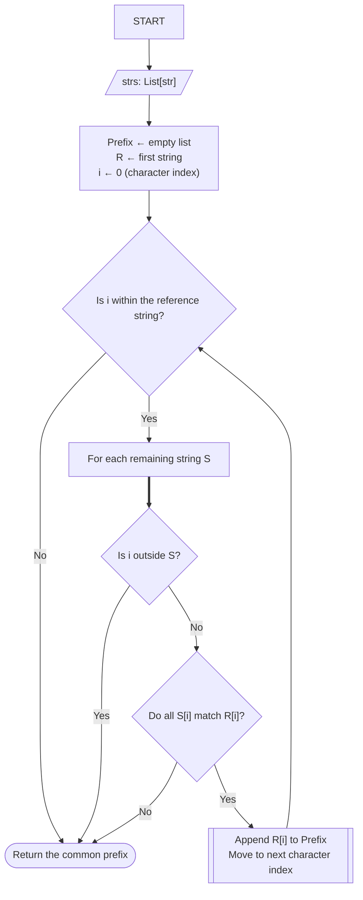

# [14. Longest Common Prefix](https://leetcode.com/problems/longest-common-prefix/)

Difficulty: Easy
Status: Pending

## Problem Statement

Write a function to find the longest common prefix string amongst an array of strings.

If there is no common prefix, return an empty string `""`.

**Example 1:**

**Input:** strs = ["flower", "flow", "flight"]
**Output:** "fl"

**Example 2:**

**Input:** strs = ["dog", "racecar", "car"]
**Output:** ""
**Explanation:** There is no common prefix among the input strings.

**Constraints:**

- `1 <= strs.length <= 200`
- `0 <= strs[i].length <= 200`
- `strs[i]` consists of only lowercase English letters if it is non-empty.

---

## Intuition
My initial approach is a two-pointer vertical scanning solution: 

First, we select the first string as reference. Then, compare their characters with every remaining string at an increasing position index, if the character at a given position is shared by all strings, we store it as part of our prefix and jumpt to the next position. If at any position our pointer is out of bound, or we find a character mismatch, we exit returning the current state of the prefix.

Conceptally, it would be something close to: 
```text
FOR each character at position i:
	FOR each string: 
		if position doesn't exist:
			RETURN prefix
		if character differs:
			RETURN prefix
	include current character in prefix
	continue
```

## Two-Pointer approach: 

### Algorithm Flow


### Implementation

```python
from typing import List


class Solution:
    def longestCommonPrefix(self, strs: List[str]) -> str:
        prefix = []
        ref_string = strs[0]
        i = 0

        while i < len(ref_string):
            s = 1
            while s < len(strs):
                eval_string = strs[s]
                if i >= len(eval_string):
                    return "".join(prefix)

                if eval_string[i] != ref_string[i]:
                    return "".join(prefix)
                s += 1
            prefix.append(ref_string[i])
            i += 1

        return "".join(prefix)

```

Notice that this implementation opted to store the characters in a list, rather than a string, since strings in Python are immutable, appending characters introduce a small overhead as the interpreter requires to sequentially create new strings and collect outdated string on garbage. While almost negligible for this scenario, it's considered a good practice.

### Refinements

```Python
from typing import List


class Solution:
    def longestCommonPrefix(self, strs: List[str]) -> str:
        prefix = []
        ref_string = strs[0]
        for i, char in enumerate(ref_string):
            for string in strs[1:]:
                if i >= len(string) or string[i] != char:
                    return "".join(prefix)
            prefix.append(char)
        return "".join(prefix)

```
## Alternate solutions
"If I weren't allowed to compare columns, what else could I compare?"

