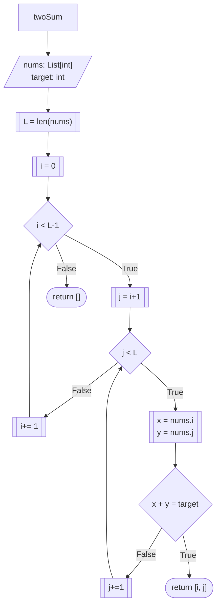
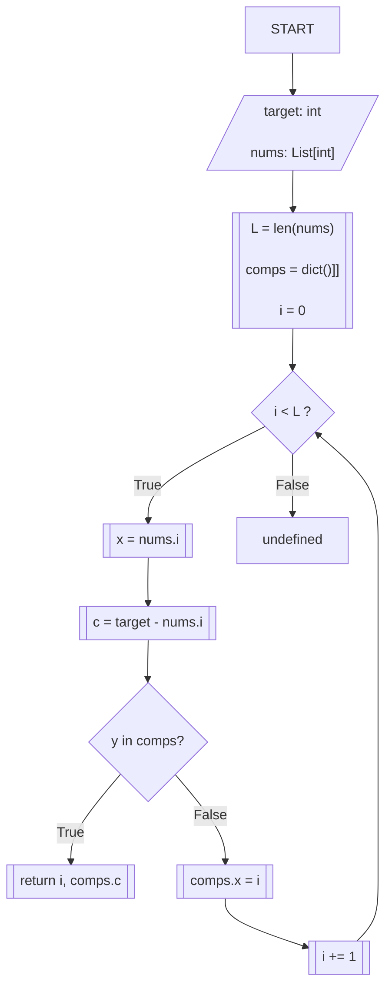

# [1. Two Sum](https://leetcode.com/problems/two-sum/)

**Status**: Solved

**Difficulty**: Easy

## Problem Statement 

Given an array of integers `nums` and an integer `target`, return _indices of the two numbers such that they add up to `target`_.

You may assume that each input would have **_exactly_ one solution**, and you may not use the _same_ element twice.

You can return the answer in any order.

**Example 1:**

* ***Input:** nums = [2,7,11,15], target = 9
* ***Output:** [0,1]
* ***Explanation:** Because nums[0] + nums[1] == 9, we return [0, 1].


**Example 2:**

* ***Input:** nums = [3,2,4], target = 6
* ***Output:** [1,2]


****Example 3:**

* ***Input:** nums = [3,3], target = 6

* ***Output:** [0,1]

**Constraints:**

- $2 <= nums.length <= 104$
- $-109 <= nums[i] <= 109$
- $-109 <= target <= 109$
- **Only one valid answer exists.**

**Follow-up:** Can you come up with an algorithm that is less than `O(n2)` time complexity?

## Intuition

## Brute Force Solution: Nested Loop
The classic, brute-force solution relies on a nested loop. In order to find the two digits $x$ and $y$ whose sum equals $target$, we traverse through every element of the array, compute a sum with each other number and compare with the reference value $target$. 

This approach requires two moving pointers: The index $i$ travels in the main loop, marking the $x$ position, the $j$ index travels through an inner loop, marking the position of $y$. Finally, we perform the $x + y == target$ evaluation for every $i, j$ pair sequentially until the solution is found.   
### The Algorithm




### Implementation

```python
from typing import List


class Solution:
    def twoSum(self, nums: List[int], target: int) -> List[int]:

        L: int = len(nums)
        i = 0
        while i < L-1:
            j = i+1
            while j < L:
                if nums[i] + nums[j] == target:
                    return [i, j]
                j+=1
            i+=1
        return []

```

This can be further refined to use a for loop for simplicity. 

```python
from typing import List


class Solution:
    def twoSum(self, nums: List[int], target: int) -> List[int]:
		for i in range(len(nums)):
			for j in range(i + 1, len(nums)):
				if nums[i] + nums[j] == target:
					return [i, j]
        return []
```

### Analysis
Notice that this approach requires making several operations where the worst case scenario requires iterating to the very end of the array in order to find the solution. 

- **Time Complexity: $O(N^2)$**: The function uses two nested loops. The main loop runs N times, and the inner loop iterates over the remaining elements. This results in exactly $\frac{N(N-1)}{2}$ operations in the worst case, giving a quadratic time complexity.
- **Space Complexity: $O(1)$** This approach evaluates elements in-place using array indices. It does not allocate any auxiliary data structures that scale with the size of the input.

## The One-pass solution
The brute-force solution repeatedly searches for the same information.

For every value `x` in the array, it scans the remaining elements looking for another value `y` such that

$$
x+y=target
$$

Even if the algorithm has already inspected a number during a previous iteration, it has no way of remembering it. As a result, many values are examined multiple times.

The natural question becomes:

> *Can we avoid searching the same values repeatedly?*

The answer is yes—but only if the algorithm maintains a record of the values it has already processed.

### From a Pair Search to a Lookup
Instead of asking

> *"Which number can I add to $x$ to reach the $target$?"*

we can rearrange the original equation.

$$
x + y = target
$$
Subtract $x$ from both sides:

$$
y = target - x
$$
Now the problem becomes much simpler.

For every element `x`, we compute the value that would complete the sum:

$$
y = target - x
$$
The question then becomes:

> Have we already seen this value?*

Notice how this completely changes the nature of the problem.

The brute-force algorithm searches through the array every time it asks that question.

Instead, we would like to answer it instantly.

### Example

Consider

```python
nums = [3, 2, 4]
target = 6
```

The algorithm processes the array from left to right. 

At the first element,

$$
x = 3
$$

Its complement is

$$
y = 6 - 3 = 3
$$
Since no numbers have been processed yet, the answer is "no."

We continue

At the second element,

$$
x = 2
$$

the complement becomes:
$$
y = 6 - 2 = 4
$$
Again, we have not seen $4$, so we continue.

Finally,

$$
x = 4
$$

Its complement is 
$$
y = 6 - 4 = 2
$$
This time the answer is **yes**.

We already encountered the value `2`, so we already know the solution is the pair `(2, 4)`.

The remaining question is: 

> *How can we answer **"Have I seen this value?"** efficiently?*

### Choosing the Right Data Structure
To support this approach, we need a data structure that remembers every value we have already processed **and** where it appeared in the array.

Each stored entry must contain two pieces of information:

- the value
- its index

A [**HashMap**](../../knowledge/hashmap.md) is an excellent fit for this requirement because it stores data as key-value pairs and provides average-case constant-time $O(1)$ lookups.

As we traverse the array, we store: `value --> index`

For example

```python
nums = [3, 2, 4]
```

After processing the first two elements, the HashMap contains

```json
{
	3: 0,
	2: 1
}
```

When we later compute the complement $2$, we simply ask the HashMap whether that key exists. If it does, the stored value immediately gives us the index of the matching element.

This is the key optimization of the algorithm: the nested search is replaced by a single dictionary lookup.
### The algorithm 

The algorithm traverses the array exactly once.

For each element:

1. Compute the complement needed to reach the target.
2. If that complement already exists in the HashMap, return both indices.
3. Otherwise, insert the current value and its index into the HashMap.


One subtle but important detail is that the lookup must occur **before** inserting the current value into the HashMap.

This guarantees that the current element is never matched against itself. Only values encountered during previous iterations are considered valid candidates.
### Implementation

```python
from typing import List


class Solution:
    def twoSum(self, nums: List[int], target: int) -> List[int]:
        L = len(nums)
        comps = {}
        i = 0

        while i < L:
            x = nums[i]
            c = target - x 
            if c in comps:
                return [i, comps[c]]
            comps[x] = i
            i += 1
        return []
                
                
```

### Analysis
- **Time Complexity**: $O(N)$ 
	The algorithm iterates through the `nums` array exactly once. During each iteration, it performs a dictionary lookup (`c in comps`) and a dictionary insertion (`comps[x] = i` ). In Python, both of these hash map operations execute in $O(1)$ runtime. Consequently, execution time scales linearly with the input size.
- **Space Complexity**: $O(N)$
	In the worst-case scenario (e.g., the target is formed by the last two elements, or no valid pair exists), the `comps` dictionary will store an entry for every element in the array resulting in linear memory allocation.

### Final refactor

**A tiny note on naming conventions**: Initially I named the dictionary `comps`, reasoning that every stored value could become the complement of a future element. After revisiting the algorithm, I realized the dictionary's responsibility is to record values that have already been processed. A name such as `seen` or `seen_values` better communicates that purpose.

That being said, the proposed solution is already pretty efficient. The goal of this final refactor is not to improve performance, but to improve readability and expressiveness. We replace the `while` loop, with a combination of a for loop and the `enumerate()` function to produced an indexed iterable object.

```python
from typing import List

class Solution: 
	def twoSum(self, nums: List[int], target: int) -> List[int]:
		seen = {}
		for i, x in enumerate(nums):
			y = target - x
			if y in seen:
				return [i, seen[y]]
			seen[x] = i
		return [] 

```
## Takeaways

The core operation in this problem is:

> _"Have I already seen this value?"_

Because that question is based on key lookup rather than sequential traversal, a HashMap is a natural fit. Selecting the right data structure often has a greater impact on performance than micro-optimizing the implementation.