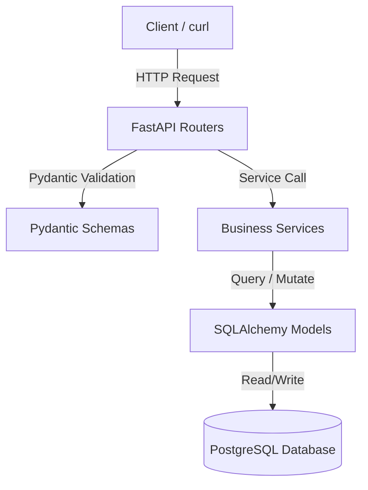

# BiteTrack Backend v2 Architecture 

BiteTrack follows a layered architecture that separates HTTP concerns, data validation, business rules, and persistence.

## Core Architectural Layout
The system follows a layered architecture to decouple routing, validation, business rules, and database access.

## Layers

### Routers (`routers/`)

Responsible for:

- HTTP routing
- Status codes
- Dependency injection
- Authentication

---

### Schemas (`schemas/`)

Responsible for:

- Request validation
- Response serialization
- API contracts

---

### Services (`services/`)

Responsible for:

- Business rules 
- Workflow orchestration 
- Database transactions 
- Coordination between repositories and domain models

---

### Models (`models/`)

Responsible for:

- Relational database mapping
- Persistence
