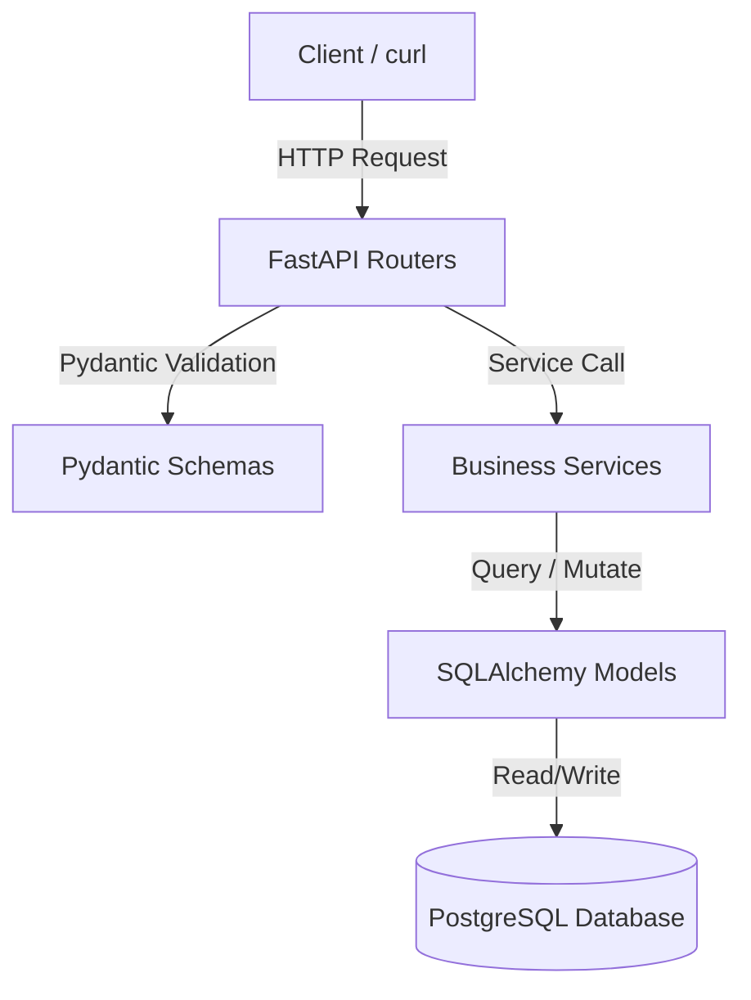

# Flagship Project Architecture

## Name: BiteTrack Backend v2
A production-grade reboot of the BiteTrack system focusing on inventory, order management, and core transactional processes using FastAPI.

## Core Architectural Layout
The system follows a layered architecture to decouple routing, validation, business rules, and database access.

## Layers:
1. **Routers (`routers/`)**: Handles HTTP routing, status codes, and security dependency injections.
2. **Schemas (`schemas/`)**: JSON serialization, deserialization, and strict input/output verification.
3. **Services (`services/`)**: Orchestrates business actions, processes transactions, and wraps DB actions.
4. **Models (`models/`)**: Represents relational tables mapped to PostgreSQL.
