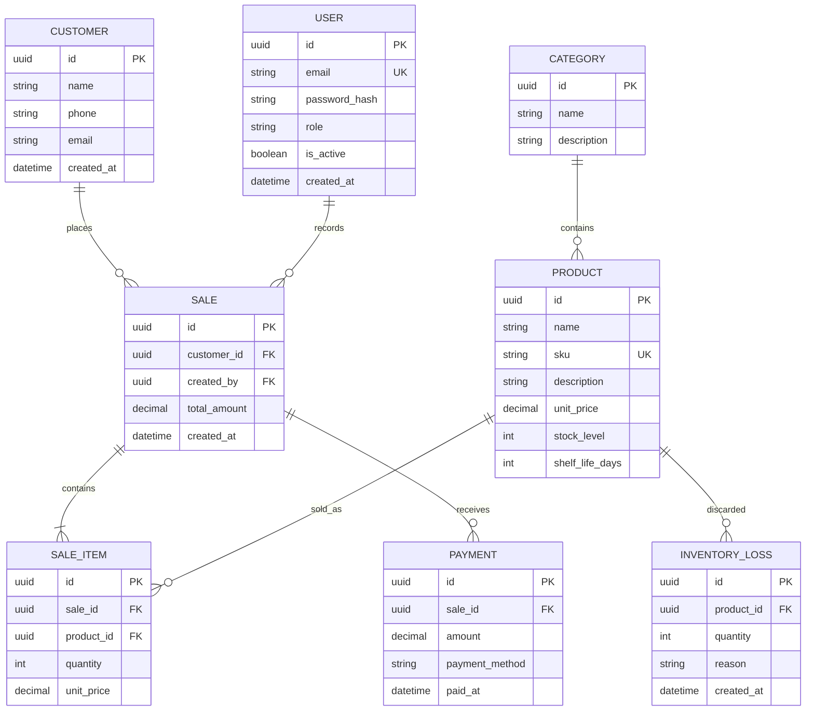

# Database Design

## Planned Domain Model

## Notes

- Outstanding customer balances are **derived** from sales and payments rather than stored directly.
- A sale may receive multiple payments.
- Product stock is maintained as a `stock_level` field during the initial project milestones.
- Inventory losses represent products removed from inventory without completing a sale.
- Payment status is derived (calculated field) from recorded payments rather than stored explicitly.