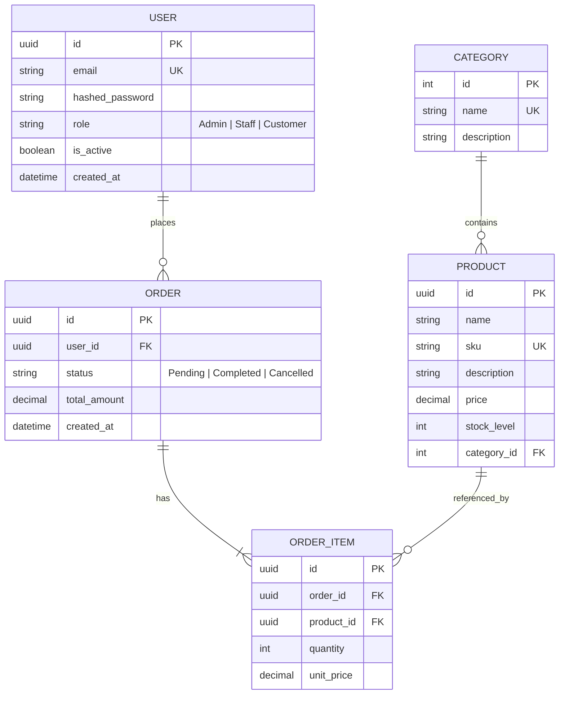

# Database Schema Design

## ERD Layout (Entity-Relationship)

```mermaid
erDiagram
    USER {
        uuid id PK
        string email UK
        string hashed_password
        string role "Admin | Staff | Customer"
        boolean is_active
        datetime created_at
    }
    CATEGORY {
        int id PK
        string name UK
        string description
    }
    PRODUCT {
        uuid id PK
        string name
        string sku UK
        string description
        decimal price
        int stock_level
        int category_id FK
    }
    ORDER {
        uuid id PK
        uuid user_id FK
        string status "Pending | Completed | Cancelled"
        decimal total_amount
        datetime created_at
    }
    ORDER_ITEM {
        uuid id PK
        uuid order_id FK
        uuid product_id FK
        int quantity
        decimal unit_price
    }

    CATEGORY ||--o{ PRODUCT : contains
    USER ||--o{ ORDER : places
    ORDER ||--|{ ORDER_ITEM : has
    PRODUCT ||--o{ ORDER_ITEM : referenced_by
```
